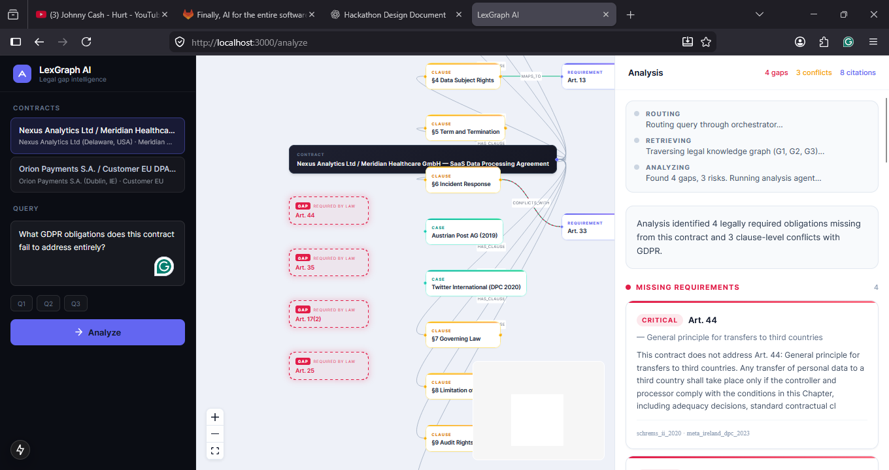
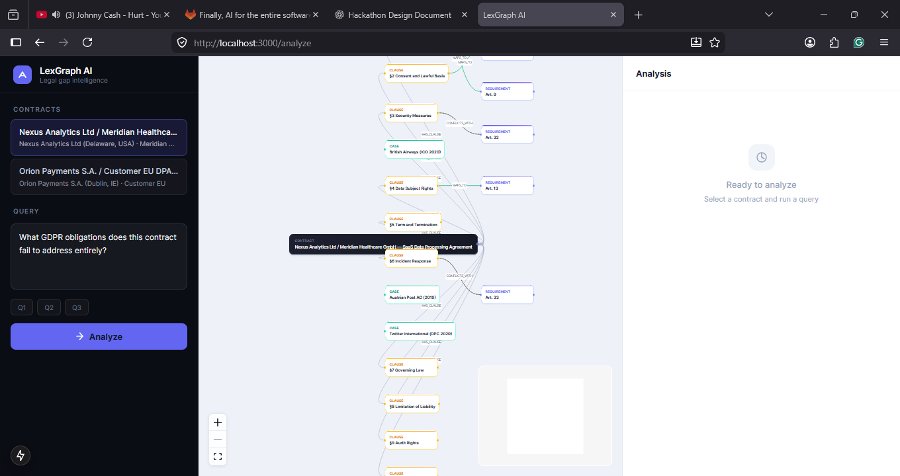
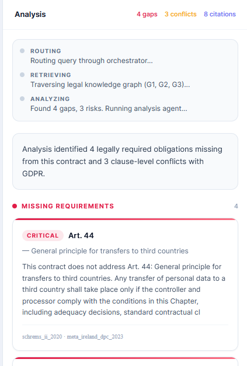
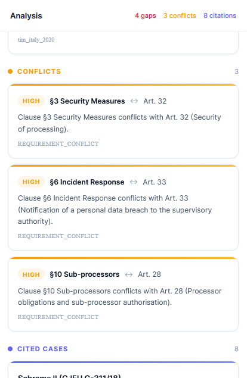

# LexGraph AI

> Traditional legal AI reads contracts.
> LexGraph reads the law.

**LexGraph AI** is a legal knowledge graph that identifies obligations required by regulation but absent from contracts — and visualizes them as Ghost Nodes: disconnected, glowing markers that make legal absence spatially visible.

Built for the National Hackathon — Legal Services track.

### Live Demo

- **App** → https://mellow-perception-production-3961.up.railway.app
- **Backend API** → https://sunny-mindfulness-production-02b3.up.railway.app

Upload your own PDF / DOCX / scanned image (Tesseract OCR runs server-side) and Ghost Node analysis runs against the GDPR knowledge graph in real time.

---

## The Problem

Most legal AI operates on extraction.

It reads a contract and tells you what is in it.
It cannot tell you what should be in it but isn't.

That gap is where legal risk lives.

A contract that never mentions data breach notification timelines, transfer safeguards, or impact assessment obligations is not an empty contract — it is a *compliant-looking* contract with invisible liabilities. The obligations exist in the law. The silence in the contract creates the exposure.

Traditional RAG cannot detect absence. It retrieves what is present. It has no model of what *must be present*.

---

## The Solution — Ghost Nodes

LexGraph models the law as a graph.

Every GDPR obligation is a node. Every enforcement case is a node. Every contract clause is a node. The edges between them encode the legal relationships: which clauses satisfy which obligations, which cases enforced which articles, which obligations are required by which jurisdictions.

**Ghost Nodes** are obligation nodes that exist in the law graph but have no edge connecting them to any clause in the contract under analysis.

They are:
- Required by law
- Missing from the contract
- Rendered as disconnected, dashed-red nodes floating outside the contract subgraph
- Each labeled with the GDPR article they represent and the enforcement case that proves the obligation is real

The visualization makes legal absence legible.

---

## Features

| Feature | Description |
|---|---|
| **Legal Knowledge Graph** | 7 node types, 10 relationship types encoding GDPR obligations, enforcement cases, and contract clauses |
| **G2 Gap Detection** | Set-difference query: all framework requirements minus requirements reachable from the contract |
| **Ghost Node Visualization** | React Flow renders missing obligations as glowing dashed-border nodes, disconnected from the contract subgraph |
| **GraphRAG Retrieval** | RRF fusion (k=60, graph weight 0.70) combining graph traversal with dense vector search |
| **Groq Analysis Agent** | Tool-calling agent on `llama-3.3-70b-versatile` with deterministic fallback — never silently empties |
| **SSE Streaming** | Stage-by-stage streaming with live graph updates mid-analysis |
| **Risk Reports** | Clause-level conflicts with GDPR articles, severity-graded with enforcement citations |
| **Dual Contracts** | `nexus_meridian` (4 deliberate gaps) and `orion_payments` (0 gaps) for live comparison |

---

## Architecture

```
Contract JSON
      │
      ▼
  Ingestion Layer
  (clause parsing, maps_to, conflicts_with)
      │
      ▼
  Legal Knowledge Graph  (in-memory property graph)
  ├── ComplianceFramework  ──HAS_REQUIREMENT──►  Requirement
  ├── Contract  ──HAS_CLAUSE──►  Clause  ──MAPS_TO──►  Requirement
  │                                        ──CONFLICTS_WITH──►  Requirement
  ├── Case  ──ENFORCED_BY──►  Requirement
  └── Court  ──DECIDED_BY──►  Case
      │
      ▼
  GraphRAG Retriever
  ├── G1: Clause → CONFLICTS_WITH → Requirement → Case   (risk detection)
  ├── G2: ALL Requirements − COVERED Requirements        (gap detection ★)
  ├── G3: Requirement → ENFORCED_BY → Case               (precedent chain)
  └── Vector: HuggingFace dense search over clauses (RRF fused)
      │
      ▼
  Analysis Agent  (Groq tool-use)
  └── emit_analysis tool → gaps, risks, citations, summary
      │
      ▼
  SSE Stream  →  React Flow Frontend
  ├── stage events     (live progress)
  ├── graph_data       (nodes + edges + gap_node_ids)
  ├── gaps / risks / citations
  └── synthesis_chunk  (streaming summary)
      │
      ▼
  Ghost Nodes  +  Risk Report  +  Citation Panel
```

---

## Tech Stack

| Layer | Technology |
|---|---|
| **API** | FastAPI 0.115 · Python 3.11 · SSE streaming |
| **Knowledge Graph** | In-memory property graph (Python adjacency lists) |
| **LLM** | Groq — `llama-3.3-70b-versatile` via tool use |
| **Embeddings** | HuggingFace `sentence-transformers/all-MiniLM-L6-v2` (local, free) |
| **Vector Store** | ChromaDB in-memory (EphemeralClient, cosine similarity) |
| **Frontend** | Next.js 15 · TypeScript · TailwindCSS |
| **Graph Visualization** | React Flow (`@xyflow/react`) · Dagre layout |
| **State** | Zustand |

**Zero infrastructure required.** No Docker. No Neo4j. No external vector database. Single `pip install` + `uvicorn`.

---

## Quick Start

### Prerequisites

- Python 3.11+
- Node.js 18+
- A free [Groq API key](https://console.groq.com) (no credit card required)

### 1. Clone

```bash
git clone https://github.com/your-org/lexgraph-ai.git
cd lexgraph-ai
```

### 2. Backend

```bash
cd backend

# Create and activate virtual environment
python -m venv .venv
source .venv/bin/activate        # Windows: .venv\Scripts\activate

# Install dependencies
pip install -r requirements.txt

# Configure
cp ../.env.example .env
# Edit .env — add your GROQ_API_KEY

# Start (auto-seeds knowledge graph on first run)
uvicorn app.main:app --host 0.0.0.0 --port 8000 --reload
```

The API auto-seeds the knowledge graph from `data/` on startup. First run downloads the HuggingFace embedding model (~90 MB, cached locally).

### 3. Frontend

```bash
# In a second terminal
cd frontend
npm install --legacy-peer-deps
npm run dev
```

### 4. Open

```
http://localhost:3000
```

### 5. Verify

```bash
curl http://localhost:8000/api/health
# {"status":"healthy","neo4j":"ok","chroma":"ok"}

curl "http://localhost:8000/api/graph/nexus_meridian?include_gaps=true" | python -m json.tool | grep gap_node_ids -A 6
# "gap_node_ids": ["gdpr_art_17", "gdpr_art_25", "gdpr_art_35", "gdpr_art_44"]
```

---

## Demo

### Recommended walkthrough

**Contract:** Nexus Analytics Ltd / Meridian Healthcare GmbH — Data Processing Agreement

**Query:**
> What GDPR obligations does this contract fail to address entirely?

**Expected Ghost Nodes:**

| Article | Obligation | Max Penalty |
|---|---|---|
| 🔴 Art. 35 | Missing DPIA (Data Protection Impact Assessment) | €20M |
| 🔴 Art. 44 | Missing Standard Contractual Clauses for third-country transfers | €20M |
| 🔴 Art. 17 | Missing Right to Erasure obligations | €20M |
| 🔴 Art. 25 | Missing Data Protection by Design requirements | €10M |

**Control contract:** Switch to Orion Payments S.A. — 0 ghost nodes, full coverage.

### The three pre-loaded queries

| | Query | Purpose |
|---|---|---|
| **Q1** | Which clauses create compliance risk under GDPR? | Clause-level conflict detection |
| **Q2** | What GDPR obligations does this contract fail to address entirely? | Gap detection (Ghost Nodes) |
| **Q3** | Show me the enforcement cases behind the 72-hour breach notification | Precedent chain traversal |

---

## Repository Layout

```
lexgraph-ai/
├── backend/
│   ├── app/
│   │   ├── main.py              FastAPI app, lifespan, CORS
│   │   ├── config.py            Pydantic Settings (env loading)
│   │   ├── api/                 health · contracts · graph · analyze (SSE)
│   │   ├── schemas/             Pydantic v2 models
│   │   ├── database/            In-memory graph store · ChromaDB client
│   │   ├── graph/               G1/G2/G3 queries · ingestion
│   │   ├── rag/                 HuggingFace embedder · RRF fusion · GraphRAG
│   │   ├── agents/              OrchestratorAgent · AnalysisAgent (Groq)
│   │   └── services/            Seed runner (auto-runs on startup)
│   ├── tests/
│   └── requirements.txt
├── frontend/
│   ├── app/                     Next.js App Router
│   ├── components/              graph · analysis · contract · query · layout
│   ├── hooks/                   useAnalysis (SSE) · useGraph
│   ├── lib/                     API client · Dagre layout
│   ├── store/                   Zustand
│   └── types/
├── data/
│   ├── contracts/               nexus_meridian.json · orion_payments.json
│   └── requirements/            gdpr_requirements.json (11 req + 9 cases)
├── docs/
│   ├── ARCHITECTURE.md
│   ├── SUBMISSION_CHECKLIST.md
│   └── screenshots/
├── .env.example
├── LICENSE
└── README.md
```

---

## Testing

```bash
cd backend
pytest -q
# tests/test_rrf.py    — RRF fusion correctness
# tests/test_schemas.py — Pydantic schema validation
```

---

## Philosophy

Most legal AI asks: *"What does this contract say?"*

LexGraph asks: *"What should this contract say, according to the law — and what is missing?"*

That difference changes everything.

A contract analysis tool that can only tell you what is present will never catch what is absent. Legal risk lives in the silence. LexGraph makes that silence visible.

The ghost node is not a UI metaphor. It is a precise legal statement: this obligation exists in the regulatory graph, it has no edge to this contract, and enforcement cases show that regulators have fined companies for exactly this absence.

---

## Screenshots

| | |
|---|---|
|  | **Ghost Nodes** — GDPR obligations missing from the contract, rendered as glowing disconnected nodes |
|  | **Contract Knowledge Graph** — full graph of clauses, requirements, and enforcement cases |
|  | **Gap Detection Report** — structured output with articles, severity, and enforcement citations |
|  | **Risk Report** — clause-level conflicts with GDPR articles |

*Screenshots captured from the live demo using `nexus_meridian` contract.*

---

## Environment Variables

| Variable | Required | Description |
|---|---|---|
| `GROQ_API_KEY` | ✅ Yes | Groq API key — free at [console.groq.com](https://console.groq.com) |
| `DATA_PATH` | No | Path to `data/` directory (default: `../data`) |
| `CORS_ORIGINS` | No | Allowed CORS origins (default: `http://localhost:3000`) |
| `GROQ_MODEL` | No | Groq model ID (default: `llama-3.3-70b-versatile`) |
| `LOG_LEVEL` | No | Logging level (default: `INFO`) |

---

## License

MIT — see [LICENSE](LICENSE).
